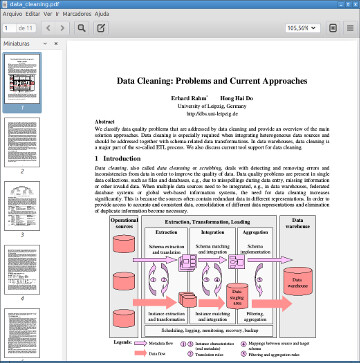
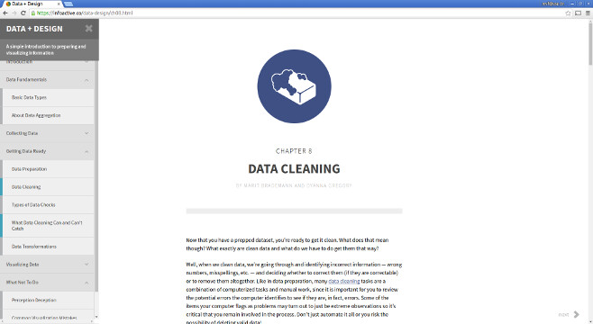
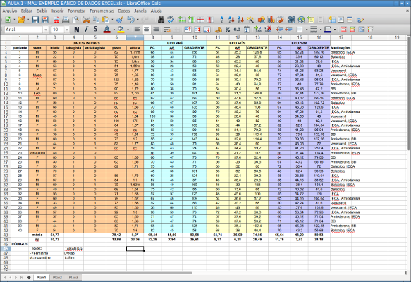

```{r setup, include=FALSE, eval=FALSE}
knitr::opts_chunk$set(echo = FALSE)
```


#Tratamento e Manuseio de Dados com R


## O que veremos

1. Princípios de Tratamento e Manuseio de Dados
2. Instalando e Rodando o Básico do R
3. Rudimentos da Linguagem R
4. Usando Pacotes do R para o Manuseio dos Dados


# Princípios de Tratamento e Manuseio de Dados  


## Princípios

### Objetivo

Organizar o conjunto de dados para que possa ser analisado estatisticamente

1. Conjuntos de Dados
1. Organizando um Conjunto de Dados
2. Programe! Não Faça Manualmente
3. Boas Práticas
4. Integração de Dois ou Mais Conjuntos de Dados


# Conjuntos de Dados


## Conjuntos de Dados

### Conceitos 

- Observação
- Variável
- Metainformação
- Conjunto de dados estruturado
- Conjunto de dados não estruturado


## Conjuntos de Dados

### Observação

- Unidade provedora de informação individual
- Pode ser 
    - uma pessoa
    - uma tentativa de execução de uma tarefa
    - uma realização de um teste


## Conjuntos de Dados

### Observação

A escolha adequada depende do contexto do _**seu**_ problema.

Um exemplo:

20 participantes são divididos em um grupo de controle e um grupo de tratamento, 
cada um com 10 participantes.  

Serão administrados um comprimido com uma dosagem de cafeina aos participantes 
do grupo de tratamento e um comprimido inerte aos participantes do grupo 
controle.


## Conjuntos de Dados

### Observação

Se registrarmos uma medida de atenção apenas após a administração do comprimido

- uma observação será a resposta de cada participante
    - simples assim


## Conjuntos de Dados

### Observação

Se registrarmos uma medida de atenção *antes* e uma *depois* a administração do 
comprimido

- uma observação poderá será a resposta de cada participante
    - em cada observação: uma medição *pré-intervenção* 
        e uma medição *pós-intervenção* 
    - cada participante gerará uma única observação
- uma observação poderá será a resposta de cada participante em cada condição
    - em cada observação: uma condição de medição (*pré* ou *pós*) 
        e a medição sob essa condição
    - cada participante gerará duas observações


## Conjuntos de Dados

### Observação

Qual é a melhor escolha?

- Depende do que você vai precisar fazer com os dados
    - em algumas situações, a primeira forma será mais adequada
    - em outras situações, a segunda forma será mais adequada
    - em outras situações ainda, ora será uma, ora será outra
        - conversão entre formatos
            - mais adiante


## Conjuntos de Dados

### Variável

- Atributos ou características de interesse nas observações
    - o que é *característica* do individuo é *variável* na população
- Podem ser *primárias* ou *derivadas* 
    - Primárias: peso, estatura
        - Derivada: IMC
    - Primárias: latitude e longitude
        - Derivada: fuso horário oficial


## Conjuntos de Dados

### Variável

- Podem ser *quantitativas* ou *qualitativas*
    - Quantitativas: valores numéricos
        - contínuas: resultados de medições
        - discretas: resultados de contagens
    - Qualitativas (ou *Categóricas*): *níveis* ou *categorias*
        - ordinais: com uma ordem entre as categorias
        - nominais: sem uma ordem ou com ordem ignorável
    - É possível a conversão entre esses tipos:
        - Contínua > Discreta > Ordinal > Nominal


## Conjuntos de Dados

### Variável

Exemplos

- estatura, peso e IMC
- pressões sistólica e diastólica
- estado civil
- condição em relação a um alelo específico: 
    - homozigoto *vs* heterozigoto
    - dominante *vs* recessivo
    - homozig. dominante *vs* heterozig. *vs* homozig. recessivo


## Conjuntos de Dados

### Metainformação

"Informação sobre a informação"

- Na verdade, informação sobre as variáveis
    - nome longo da variável
    - tipo: contínua, discreta, ordinal, nominal
    - para variáveis qualitativa: 
        - quantos e quais são as categorias possíveis
        - nome longo para as categorias
            - para as ordinais: ordem entre as categorias
    - para variáveis derivadas: relação com as outras variáveis 
        - $IMC = \frac{peso}{estatura^2} \Leftrightarrow$ `IMC = peso/estatura^2`


## Conjuntos de Dados

### Conjunto de Dados Estruturado
    
- *Linha = Observação*
- Todas as linhas contêm os valores das mesmas variáveis e na mesma sequência
- O conjunto de dados contém metainformações


## Conjuntos de Dados

### Conjunto de Dados Estruturado

*Linha = Observação*

- cada linha contém os dados de uma única observação
- os dados de uma mesma observação estão todos em uma única linha


## Conjuntos de Dados

### Conjunto de dados estruturado
    
Todas as linhas contêm os valores das mesmas variáveis e na mesma sequência

    Nome: João; Sobre: Silva; Idade: 23; Estat: 1,67 m; EstCiv: Solteiro
    Nome: Maria; Sobre: Alves; Idade: 32; Estat: 1,63 m; EstCiv: Casado

é o mesmo que 

    Nome   Sobre  Idade  Estat  EstCiv
    João   Silva  23     1,67   Solteiro
    Maria  Alves  32     1,63   Casado


## Conjuntos de Dados

### Conjunto de Dados Estruturado

O conjunto de dados contém as metainformações referentes aos dados

    Sobre: "Sobrenome"
    NomeInt = Nome + Sobre
    EstCiv: "Estado Civil"
    EstCiv: {Solteiro, Casado, UniaoEstavel, Divorciado, Desquitado, Viuvo}
    Idade: "Idade em anos Completos"
    Idade: "%3d"
    Idade: [0, 150]
    Estatura: "Estatura em metros com até a segunda casa decimal"
    Estatura: "%4.2f"
    Estatura: (0, 3)


## Conjuntos de Dados

### Conjunto de Dados Não Estruturado

- Cada linha pode conter os dados de mais do que uma observação
- Os dados de uma mesma observação pode aparecer em mais de uma linha
- Nem todas as variáveis estão presentes em todas as observações
- As observações podem ter mais de um valor para a mesma variável
- As variáveis podem aparecer em qualquer ordem
- O conjunto de dados pode não conter metainformações


# Organizando um Conjunto de Dados


## Organizando um Conjunto de Dados

1. Importação a partir de um arquivo criado por outros programas
2. Crítica dos dados
3. Formato do conjunto de dados
4. Transformações de variáveis


## Importação dos Dados

Origens possíveis para os dados

- Excel
- Google Forms
- Coleta biométrica de dados
    (e.g., sensores, actímetro, *eye tracking* etc.)
- Dados armazenados em arquivos de outros programas estatísticos 
    (SPSS, Stata, Minitab, SAS etc.)
- Dados oriundos de sistemas de gerenciamento de bancos de dados (SGBD), 
    extraídos via, e.g., SQL
- Dados não estruturados coletados eletronicamente
    (e.g., *log* das buscas realizadas no Google em um intervalo de uma hora)


## Importação dos Dados

Problemas que podem ocorrer na importação dos dados

- mais de um *encoding* utilizado no conjunto de arquivos a serem importados
    - ASCII puro
    - ISO 8859, ISO 8859-1, ISO 8859-15 (padrões do Windows no ocidente)
    - Unicode (ISO 10646), UTF-32, UTF-16, UTF-8 (padrão web atual)
- várias abas dentro da mesma planilhas do Excel
- formato de arquivo desconhecido
- arquivos corrompidos

## Crítica dos Dados
Detecção e correção de potenciais erros de digitação, transcrição e manuseio, 
bem como orientação para realização das correções

                                        "Shit happens" (Confúcio)
                                        "... all the time" (Lao Tse)

1. Padrões de erros
2. Valores não razoáveis
3. Valores discrepantes (*outliers*)
4. Uso inconsistente dos nomes de categorias
5. Inconsistências
6. Listagem de valores a serem verificados


## Crítica dos Dados

### Padrões de Erros

Começou em uma linha e passou para a próxima sem perceber 

```{r, echo = F}
data.frame(
  A = c("   1", "   2", "   1", "    ", "   4"),
  B = c("  10", "  12", "  11", "    ", "  13"),
  C = c("0.23", "0.57", "0.62", "    ", "0.72"),
  D = c("   A", "   B", "    ", "   B", "   A"),
  E = c("masc", " fem", "    ", " fem", " fem"),
  F = c(" 125", " 200", "    ", " 400", " 300")
)
```


## Crítica dos Dados

### Padrões de Erros

Pulou uma coluna, deixou em branco e continuou na seguinte

```{r, echo = F}
data.frame(
  A = c("   1", "   2", "   1", "   4"),
  B = c("  10", "  12", "    ", "  13"),
  C = c("0.23", "0.57", "  11", "0.72"),
  D = c("   A", "   B", "0.62", "   A"),
  E = c("masc", " fem", "   B", " fem"),
  F = c(" 125", " 200", " fem", " 300"),
  G = c("    ", "    ", " 400", "    ")
)
```


## Crítica dos Dados

### Padrões de Erros

Digitou sobre uma célula já preenchida ou pulou um valor

```{r, echo = F}
data.frame(
  A = c("   1", "   2", "   1", "   4"),
  B = c("  10", "  12", "0.62", "  13"),
  C = c("0.23", "0.57", "   B", "0.72"),
  D = c("   A", "   B", " fem", "   A"),
  E = c("masc", " fem", " 400", " fem"),
  F = c(" 125", " 200", "    ", " 300")
)
```


## Crítica dos Dados

### Valores Não Razoáveis

Muitas variáveis quantitativas têm intervalos de valores possíveis claramente 
definidos.  

Valores fora desses intervalos são suspeitos e devem ser confirmados 
individualmente.

Exemplo: idade superior a 100 anos

- não é um erro
- mas é raro


## Crítica dos Dados

### Valores Discrepantes

Queria ter digitado `12.34`, mas digitou `124`

```{r, fig.height=3, fig.width=5}
tempo <- c(12.36, 12.42, 124, 11.99, 10.77, 11.05, 13.20)
boxplot(tempo, horizontal = T)
```
   


## Crítica dos Dados

### Uso inconsistente dos nomes de categorias

Mais de um rótulo para a mesma categoria

```{r, echo = F}
data.frame(
  Sexo    = c("   M", "Masc", "   F", "   f"),
  Estádio = c("   2", "  II", "Est1", "  1A"),
  Hodgkin = c(" não", "   n", " nao", "   0"),
  Benigno = c(" Ben", " sim", "   B", "   s")
)
```


## Crítica dos Dados

### Inconsistências

Os valores individuais das variáveis podem não ser suspeitos, mas a sua 
combinação pode ser

- Participante com 12 anos de idade e com 40 anos de instrução
- A soma de horas das atividades realizadas em um dia superam 24h
- Etc.


## Crítica dos Dados

### Listagem de Valores a Serem Verificados

Algumas vezes, esses erros podem ser corrigidos na fase de importação e crítica,
mas, na maioria da vezes, não.

Por isso, é útil gerar uma listagem individualizando quais observações precisam 
de confirmação (e em quais variáveis) e redigitação caso seja constatado erro. 


## Crítica dos Dados

### Listagem de Valores a Serem Verificados

Em algumas vezes, pode ser útil que essa listagem seja gerada duas vezes: 

- uma listagem ordenada por observação (útil para o verificador)

- uma listagem ordenada por variável (útil para o programador)


## Crítica dos Dados

### "Para saber mais, clique em ..."

"Ok, fiquei interessado pelo assunto de crítica e limpeza de dados."

"Onde posso encontrar mais sobre o assunto?"


## Crítica dos Dados

### "Para saber mais, clique em ..."

Google!  (*Id est*, te vira, negão!)

Mas com os termos certos.

- "Data Cleaning"
- "Data Cleansing"
- "Data Scrubbing"
- "Data Design"
- entre outros


## Crítica dos Dados

### "Para saber mais, clique em ..."

Devido ao crescimento do interesse por *Big Data* 
e por *Quantitative Analytics* em geral, 
hoje em dia também há muita literatura interessante sobre o assunto 
fora da Estatística e dentro da Computação em geral.


## Crítica dos Dados

### "Para saber mais, clique em ..."

Por exemplo, é possível encontrar
[isto](http://betterevaluation.org/sites/default/files/data_cleaning.pdf)

<http://betterevaluation.org/sites/default/files/data_cleaning.pdf>




## Crítica dos Dados

### "Para saber mais, clique em ..."

ou [isto](https://infoactive.co/data-design/ch08.html)

<https://infoactive.co/data-design/ch08.html>




## Formato do Conjunto de Dados

Adequação do formato do conjunto de dados ao uso pretendido  

1. Formato largo *vs* formato longo
2. Conversão de conjunto de dados de um formato para o outro


## Formato do Conjunto de Dados

### Formato Largo (*Wide*) 

Algumas funções que implementam técnicas estatísticas (*e.g.*, análise de 
variância com medidas repetidas) exigem os dados neste formato ...

```{r, echo=FALSE}
data.frame(
  suj = c(1, 2, 3), 
  dilat.t0 = c(2.1, 1.7, 2.1),
  dilat.t1 = c(2.3, 1.9, 2.5)
  )
```


## Formato do Conjunto de Dados

### Formato Longo (*Long*)

... já outras exigem os dados neste formato (*e.g.*, funções para gerar 
gráficos e visualizações)

```{r, echo=FALSE}
data.frame(
  suj = c(1, 1, 2, 2, 3, 3), 
  tempo = c(0, 1, 0, 1, 0, 1), 
  dilat = c(2.1, 2.3, 1.7, 1.9, 2.1, 2.5)
  )
```


## Formato do Conjunto de Dados

### Conversão de um formato para o outro conforme a necessidade

```{r, echo=FALSE}
data.frame(
  suj = c(1, 2, 3), 
  dilat.t0 = c(2.1, 1.7, 2.1),
  dilat.t1 = c(2.3, 1.9, 2.5)
  )
data.frame(
  suj = c(1, 1, 2, 2, 3, 3), 
  tempo = c(0, 1, 0, 1, 0, 1), 
  dilat = c(2.1, 2.3, 1.7, 1.9, 2.1, 2.5)
  )
```


## Transformação de Variáveis

1. Dado Quantitativo $\rightarrow$ Dado Quantitativo
2. Dado Quantitativo $\rightarrow$ Dado Qualitativo
3. Dado Qualitativo $\rightarrow$ Dado Qualitativo
4. Dado Textual $\rightarrow$ Dado Qualitativo/Quantitativo


## Transformação de Variáveis

### Dado Quantitativo $\rightarrow$ Dado Quantitativo

#### Arredondamento

```{r}
tempos <- c(314.326, 42.597, 0.817, 7.914, 197.314, 12.480)
round(tempos, 1)
round(tempos)
```


## Transformação de Variáveis

### Dado Quantitativo $\rightarrow$ Dado Quantitativo

#### Reexpressão em outras escalas

```{r, fig.height=3, fig.width=5}
boxplot(tempos, horizontal = T)
```


## Transformação de Variáveis

### Dado Quantitativo $\rightarrow$ Dado Quantitativo

#### Reexpressão em outras escalas

```{r, fig.height=3, fig.width=5}
boxplot(log(tempos), horizontal = T)
```


## Transformação de Variáveis

### Dado Quantitativo $\rightarrow$ Dado Qualitativo

#### Categorização

```{r}
idades <- c(8, 12, 17, 21, 25, 40, 80)
cortes <- c(0, 12, 17, 59, Inf)
categs <- c("criança", "adolescente", "adulto", "idoso")
data.frame(idade = idades, 
    faixa.etária = cut(idades, breaks = cortes, labels = categs))
```


## Transformação de Variáveis

### Dado Qualitativo $\rightarrow$ Dado Qualitativo

#### Junções de categorias

```{r}
cortes2 <- c(0, 17, Inf)
categs2 <- c("menor", "maior")
data.frame(idade = idades, 
    faixa.etária = cut(idades, breaks = cortes, labels = categs), 
    status.legal = cut(idades, breaks = cortes2, labels = categs2))
```


## Transformação de Variáveis

### Dado Qualitativo $\rightarrow$ Dado Qualitativo

#### Renomeando categorias

```{r}
categs3 <- c("F1", "F2", "F3", "F4")
data.frame(
    idade = idades, 
    faixa.etária = cut(idades, breaks = cortes, labels = categs),
    faixa = cut(idades, breaks = cortes, labels = categs3))
```


## Transformação de Variáveis

### Dado Textual $\rightarrow$ Dado Qualitativo/Quantitativo

1. Filtragem de texto
2. Identificação de presença de padrão
3. Transformação de texto


## Transformação de Variáveis

### Dado Textual $\rightarrow$ Dado Qualitativo/Quantitativo

Na verdade, uma área inteira de análise de dados é baseada nessa ideia: a 
análise estatística de um *corpus* textual.

O que veremos aqui não tem a pretensão de ser uma introdução aos conjuntos de 
técnicas dessa área, mas simplesmente ser uma apresentação ao problema em si.

Se a complexidade do problema estiver muito grande, procure se aconselhar com 
alguém que já tenha lidado com isso antes.


## Transformação de Variáveis

### Dado Textual $\rightarrow$ Dado Qualitativo/Quantitativo

**Sugestão** 

Se você tem pouca experiência:

- Passe essa atividade para alguém que já saiba fazer isso
- **OU**
- Reserve um bocado de tempo para aprender a fazer isso direito.


## Transformação de Variáveis

### Dado Textual

#### Filtragem de texto

```{r}
nomes <- c("Marcos", "marcos", "Pedro", "pEDRO", "maRcoS", "MARCOS")
data.frame(Nome = nomes, seq = seq(nomes))
```


## Transformação de Variáveis

### Dado Textual

#### Filtragem de texto

```{r}
filtro <- tolower(nomes) == "marcos"
data.frame(Nome = nomes, seq = seq(nomes))[filtro, ]
filtro
```


## Transformação de Variáveis

### Dado Textual

#### Identificação de presença de padrão

```{r}
comentário <- c("gostei", "não gosto", "agosto", "odiei Gião")
data.frame(o.que.disse = comentário, 
    referência.ao.verbo.gostar = grepl("(^|[ ])gost[^ ]+", comentário))
```


## Transformação de Variáveis

### Dado Textual

#### Transformação de texto

```{r}
nome <- c("Márcia", "Mârcia", "Marcia", "Marcîa")
data.frame(Nome = nome, nome = iconv(nome, to = "ASCII//TRANSLIT"))
```


# Programe! Não faça manualmente!


## Programe! Não faça manualmente!

Processamento manual dos dados  

- Erros assistemáticos
    - Difíceis de detectar e de localizar
    
Processamento dos dados através de programação  

- Erros sistemáticos
    - Mais fáceis de detectar e de localizar


## Programe! Não faça manualmente!

*Por quê programar se posso fazer na unha?*

1. Rastreabilidade
    - “Esses dados estão certos?” 
        - Você mesmo, após seis meses sem mexer nos dados
2. Documentação
    - “O quê é que são esses dados mesmo?”  
        - *Idem*, *ibidem*
3. Reaproveitabilidade de esforço e de código 
    - Lavoisier: "Nada se cria e nada se perde: tudo se aproveita."


# Boas Práticas

## Boas Práticas

- 


## Boas Práticas

1. Não jogue fora o original
2. Porque é tão fácil bagunçar um conjunto de dados no Excel
3. Variáveis primárias *vs* variáveis derivadas
4. **Vetorização**


## Boas Práticas

### Não jogue fora o original

**É sério**: é muito comum mexer no arquivo original dos dados, 
perceber que alguma ~~cagada~~ besteira foi feita 
e não haver uma cópia do original.

Por isso, antes de começar a mexer nos dados, **crie uma cópia do arquivo de 
dados original e deixe-a fora da pasta de trabalho,** a salvo dos seus dedinhos.

- Depois não diga que eu não avisei.


## Boas Práticas

### Porque é tão fácil bagunçar um conjunto de dados no Excel




## Boas Práticas

### Porque é tão fácil bagunçar um conjunto de dados no Excel

- O conceito de planilha eletrônica foi desenvolvido para armazenar dados não 
estruturados.  

- Ela pode ser usada para armanzenar dados estruturados, mas ela não te obriga 
a estruturar os dados para poder armazená-los.

- É aí que nasce o problema


## Boas Práticas

### Porque é tão fácil bagunçar um conjunto de dados no Excel

Metainformação implícita ao invés de explícita

1. Metainformação na forma de pistas visuais
    - uso de cores
    - fontes, negrito, itálico
    - etc.
    - nada disso é processado por um programa de importação de dados
2. Armazene metainformação em forma textual explícita
    - Isso permitirá que ela seja processada pelo seu programa de importação


## Boas Práticas

### Porque é tão fácil bagunçar um conjunto de dados no Excel

Variáveis Primárias e Variáveis Derivadas

- Variáveis derivadas criadas com *fórmulas* do Excel
- Problemas:
    - mais metainformação não processada pelo seu programa de importação de 
        dados 
    - multiplicação de fórmulas = mais chances de erro
        - O Demônio do *Clica-e-Arrasta*
        - O Demônio do *Copy-Paste*


## Boas Práticas

### Porque é tão fácil bagunçar um conjunto de dados no Excel

Variáveis Primárias e Variáveis Derivadas

- Solução:
    - armazene na sua planilha Excel exclusivamente as variáveis primárias
    - deixe para calcular todas as variáveis derivadas no seu programa


## Boas Práticas

### Vetorização

Para evitar *loops* explícitos, pois *loops* explícitos são geralmente:

1. mais lentos em R, 
2. mais sujeitos a erros e 
3. menos legíveis


## Boas Práticas

### *Loops* explícitos são menos legíveis

*Loop* explícito 

```{r, echo=TRUE, eval=FALSE}
for (i in 1:10) {
    y[i] <- x[i] + 1
}
```

Versão vetorizada

```{r, echo=TRUE, eval=FALSE}
y <- x + 1
```


## Boas Práticas

### *Loops* explícitos são mais sujeitos a erros

Queria ter escrito

```{r, echo=TRUE, eval=FALSE}
for (i in 1:10) {
    y[i] <- x[i] + 1
}
```

mas acabou escrevendo

```{r, echo=TRUE, eval=FALSE}
for (i in 1:100) {
    y[i] <- x[i] + 1
}
```


## Boas Práticas

### *Loops* explícitos são mais sujeitos a erros

Queria ter escrito

```{r, echo=TRUE, eval=FALSE}
for (i in 1:10) {
    y[i] <- x[i] + 1
}
```

mas acabou escrevendo

```{r, echo=TRUE, eval=FALSE}
for (i in 1:10) {
    y[i] <- x[j] + 1
}
```


## Boas Práticas

### *Loops* explícitos são mais sujeitos a erros

Queria ter escrito

```{r, echo=TRUE, eval=FALSE}
for (i in 2:10) {
    y[i] <- x[i-1]
}
```

mas acabou escrevendo

```{r, echo=TRUE, eval=FALSE}
for (i in 1:10) {
    y[i] <- x[i-1]
}
```


## Boas Práticas

### *Loops* explícitos são mais sujeitos a erros

Queria ter escrito

```{r, echo=TRUE, eval=FALSE}
for (i in 2:10) {
    y[i] <- x[i-1]
}
```

mas acabou escrevendo

```{r, echo=TRUE, eval=FALSE}
for (i in 2:10) {
    y[i] <- x[i-10]
}
```


# Integrando Conjuntos de Dados


## Integrando Conjuntos de Dados

A integração de dois ou mais conjuntos de dados envolve um grau de complexidade 
maior do que a organização de um conjunto de dados individual.


## Integrando Conjuntos de Dados

O grau de complexidade pode variar

- simplesmente juntar em um conjunto de dados unificado as observações (linhas) 
    de conjuntos de dados que tenham exatamente as mesmas variáveis (colunas)
    - caso mais simples
- realizar agregações em níveis diferentes em cada conjunto de dados até que 
    todos os conjunto de dados tenham observações (linhas) associáveis entre si
    - caso bem menos simples


## Integrando Conjuntos de Dados

**Sugestão** 

Se você tem pouca experiência:

- Passe essa atividade para alguém que já saiba fazer isso
- **OU**
- Reserve um bocado de tempo para aprender a fazer isso direito.


# Instalando e Rodando o Básico do R

Vá para a apresentação  
[Instalando e Rodando o Básico do R](../InstalaR/instalando.rodando.R.html)


# Rudimentos da Linguagem R

Vá para a apresentação  
[Rudimentos da Linguagem R](../IntroLingR/rudimentos.linguagem.R.html)


# Usando Pacotes do R para o Manuseio dos Dados

Vá para a apresentação  
[Usando Pacotes do R para o Manuseio de Dados](pacotes.manuseio.dados.R.html)

